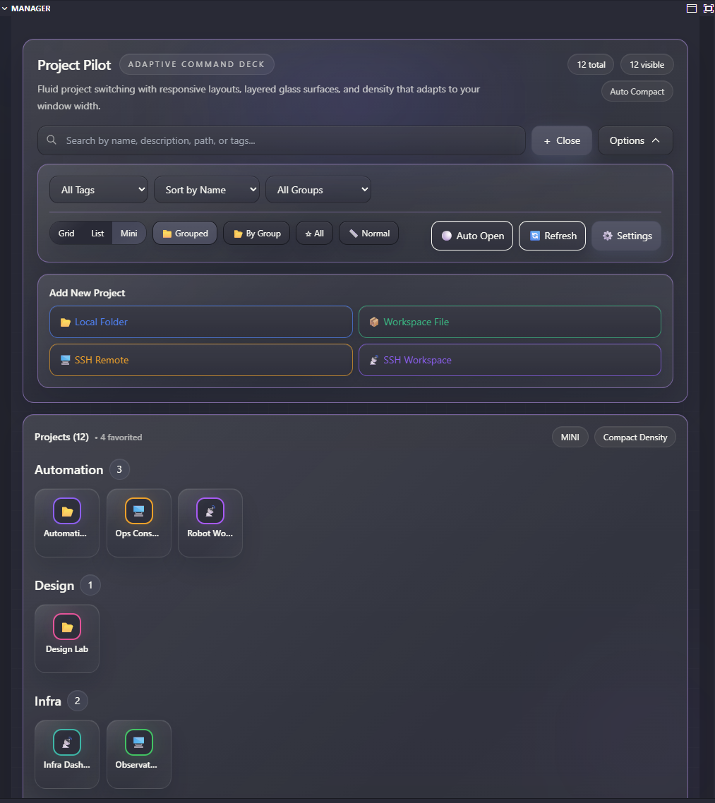
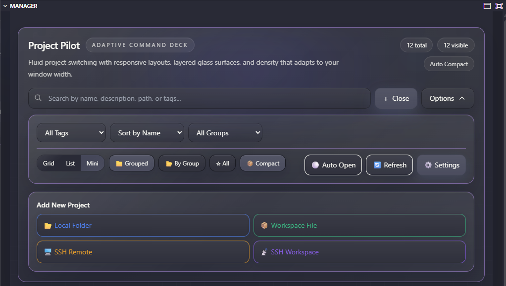
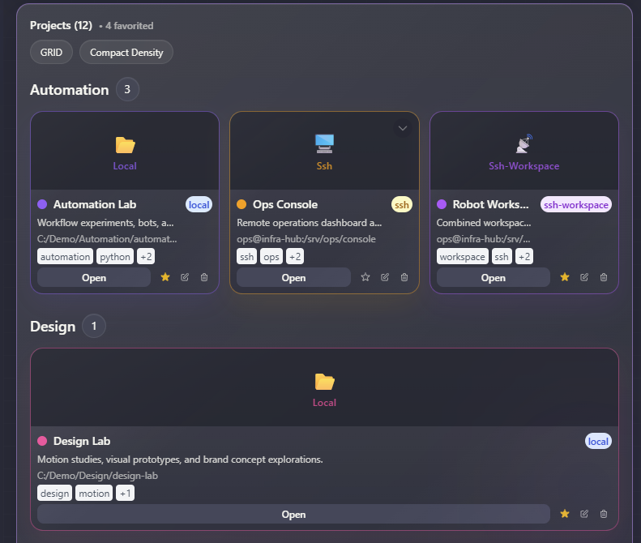
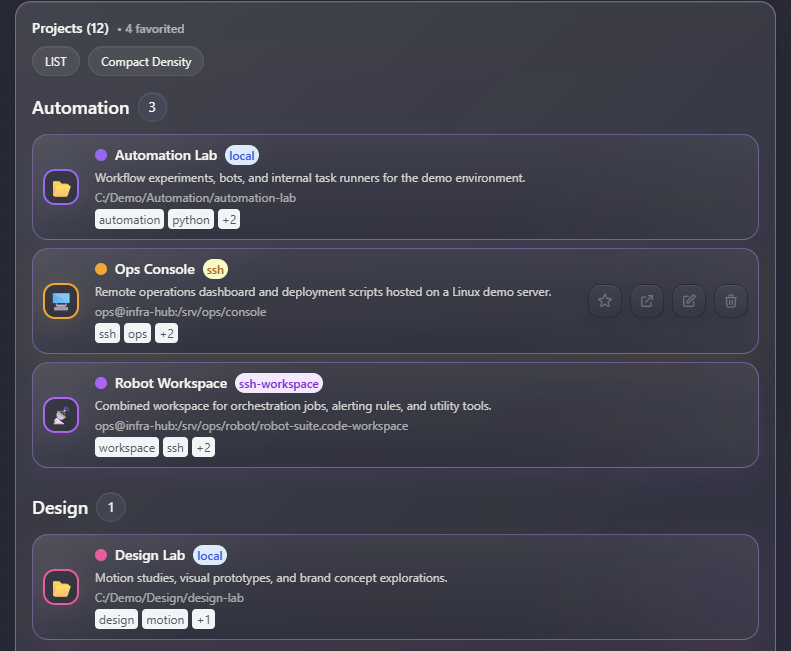
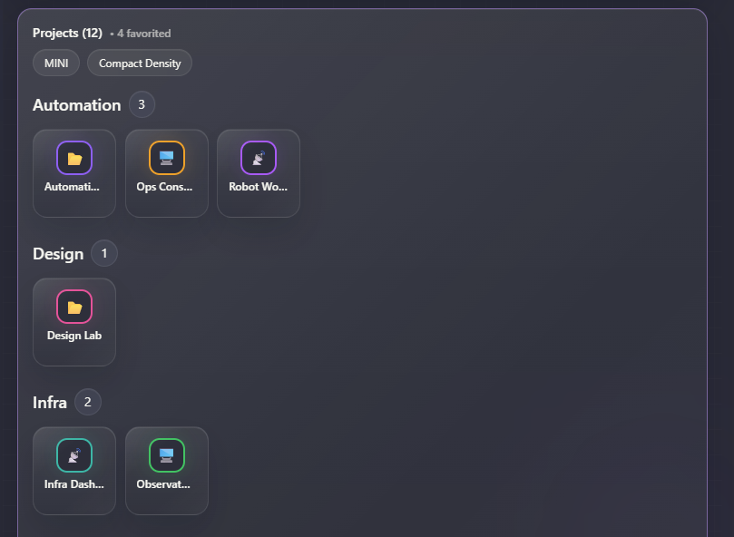
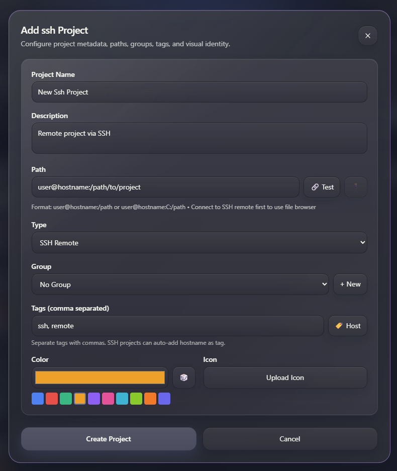
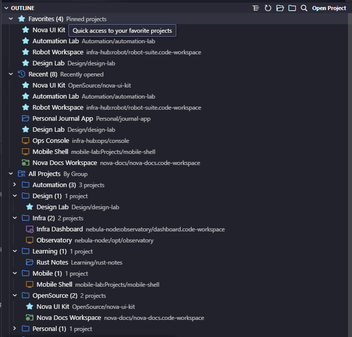

# Project Pilot

Launch local folders, workspace files, and SSH projects from one modern command deck.

[](https://marketplace.visualstudio.com/items?itemName=yczhang1028.project-pilot)
[](https://open-vsx.org/extension/yczhang1028/project-pilot)



## Why Project Pilot

- One place for `local`, `.code-workspace`, `ssh`, and `ssh-workspace` targets
- Adaptive `Grid`, `List`, and `Mini` layouts for sidebars and fullscreen
- A stronger `Outline` with `By Group`, `By Target`, `By Type`, and `Flat`
- Portable local JSON config with import, export, backup, and restore
- A refined 2.0 glass-style UI with cleaner controls and unified modals

## New In 2.0

- Modern glass-inspired interface refresh
- Better adaptive layouts for sidebars and fullscreen
- Favorites and recent sections in Outline
- Richer Outline context actions
- Cleaner command palette with less noise
- Proper overlay Add/Edit modals



## Screenshots

### Grid


### List


### Mini


### Add / Edit


### Outline


## Quick Start

1. Install the extension from the marketplace or Open VSX.
2. Open the Command Palette.
3. Run `Project Pilot: Show Manager`.
4. Add your first project with `+ Add` or `Project Pilot: Add Local Folder`.

## Main Features

### Manager
- Responsive manager UI with `Grid`, `List`, and `Mini` views
- Search by name, path, description, and tags
- Group projects visually and customize colors, icons, and tags
- Unified Add/Edit modal with better overlay behavior

### Outline
- Cycle between `By Group`, `By Target`, `By Type`, and `Flat`
- Favorites and recent sections surface important projects automatically
- Right-click actions for copy path, move group, favorite toggle, delete, and SSH testing

### SSH Support
- Supports `user@hostname:/path/to/project`
- Supports Windows-style remote paths like `user@hostname:C:/path/to/project`
- Supports `vscode-remote://ssh-remote+hostname/path`
- Built-in SSH connection testing before opening

### Configuration
- Stored locally on your machine
- Import, export, backup, restore, and JSON editing workflows
- Works across VS Code, Cursor, and similar editors without remote installation

## Main Commands

| Command | Description | Shortcut |
|---------|-------------|----------|
| `Project Pilot: Show Manager` | Open the main manager | `Ctrl+P Ctrl+P` |
| `Project Pilot: Open Fullscreen View` | Open the fullscreen manager | `Ctrl+P Ctrl+F` |
| `Project Pilot: Add Local Folder` | Add a local folder | `Ctrl+P Ctrl+L` |
| `Project Pilot: Add Current Folder` | Add the currently open folder | `Ctrl+P Ctrl+C` |
| `Project Pilot: Add Workspace File` | Add a `.code-workspace` file | - |
| `Project Pilot: Add SSH Remote` | Add an SSH project | - |
| `Project Pilot: Add SSH Workspace` | Add a remote workspace file | - |
| `Project Pilot: Cycle Outline Mode` | Cycle Outline browsing modes | - |
| `Project Pilot: Sync Configuration` | Import, export, replace, or edit config | - |
| `Project Pilot: Test SSH Connection` | Validate SSH project paths | - |

## Configuration File

Project data is stored locally in:

- Windows: `%APPDATA%/Code/User/globalStorage/project-pilot/data/projects.json`
- macOS: `~/Library/Application Support/Code/User/globalStorage/project-pilot/data/projects.json`
- Linux: `~/.config/Code/User/globalStorage/project-pilot/data/projects.json`

All project data stays local, including SSH entries.

## Development

```bash
npm run build
npm run build:ext
npm run build:webview
```

## License

MIT License - see `LICENSE`.