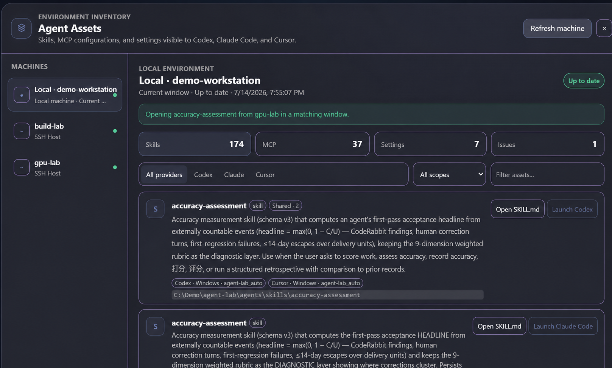
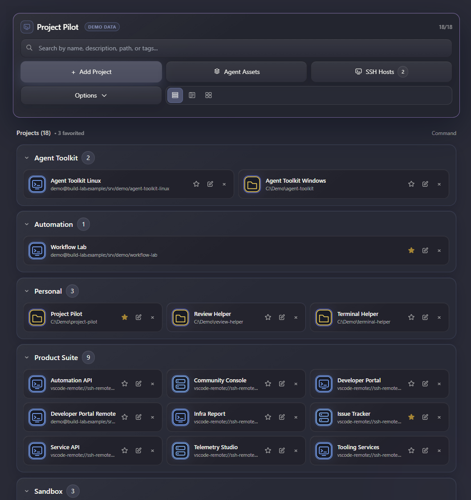
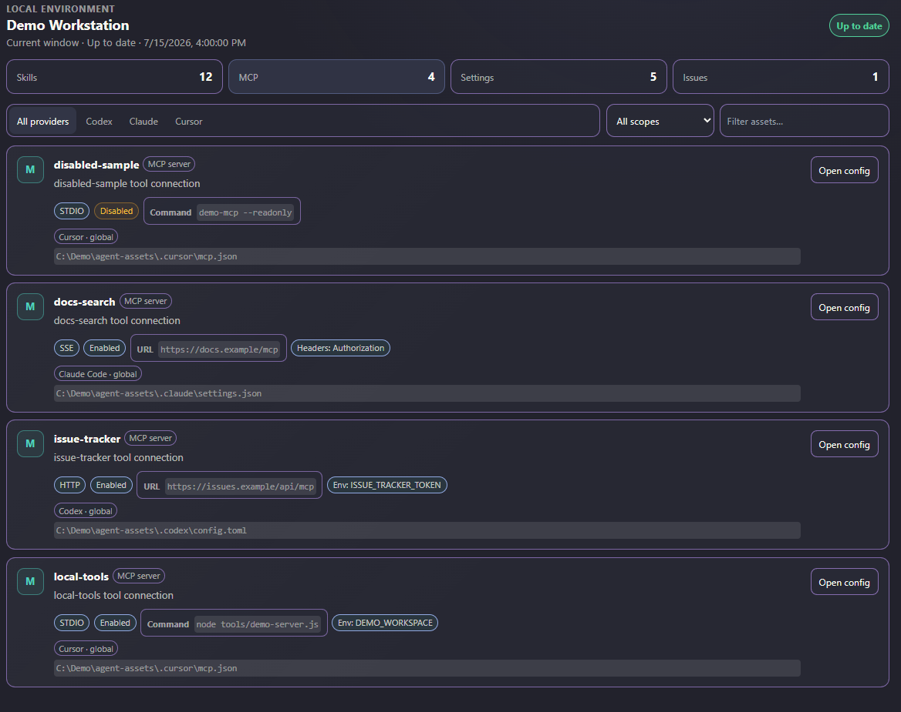
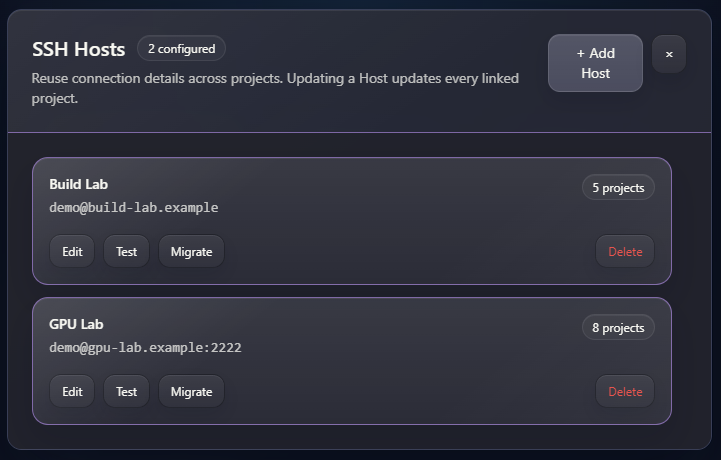

# Project Pilot

Manage projects, SSH hosts, and the agent environment around them from one VS Code command deck.

[](https://marketplace.visualstudio.com/items?itemName=yczhang1028.project-pilot)
[](https://open-vsx.org/extension/yczhang1028/project-pilot)



## Project Pilot 4.0

Version 4.0 expands Project Pilot from a project launcher into an agent environment manager.

- **Agent Assets** — inventory Skills, MCP servers, and settings used by Codex, Claude Code, and Cursor.
- **Local + SSH visibility** — inspect the current machine and every reusable SSH Host from one fullscreen editor.
- **Provider and scope awareness** — distinguish global and project assets, including shared physical locations.
- **MCP server details** — show each configured server, transport, safe command or endpoint metadata, environment key names, and validation state instead of stopping at the config filename.
- **Fast, explicit scans** — load the last inventory immediately, scan one machine at a time with progress and cancellation, and mark cached results stale after their freshness window.
- **Safer SSH recovery** — turn authentication and changed-host-key failures into reviewable terminal commands for key setup or `ssh-keygen -R` recovery.
- **Responsive performance** — resizing is CSS-driven; the covered Manager and off-screen Agent Asset cards are skipped from unnecessary layout and paint work.

Agent Assets is a read-only inventory in 4.0. It does not copy, move, delete, or synchronize agent files.

## What It Manages

### Projects

- Local folders
- Local `.code-workspace` files
- SSH folders
- SSH `.code-workspace` files
- Favorites, recent projects, groups, tags, and reusable icons

### SSH Hosts

- Reusable hostname, username, and optional port records
- One Host shared by multiple remote projects
- Bounded non-interactive connection tests
- Migration and impact-aware deletion flows
- Guided key-login and known-host recovery commands

### Agent Assets

- Codex, Claude Code, and Cursor Skills
- Global and per-project Skills
- MCP servers parsed from supported JSON, JSONC, and TOML configuration locations
- Agent settings files and validation issues
- Shared paths, symbolic links, and provider bindings
- Local Windows, local Unix, remote Linux, and remote Windows environments

## Manager Layouts

Use the three-way layout switch in either the sidebar or fullscreen Manager:

- **Command** — compact rows for fast project switching.
- **Explorer** — dense aligned records for scanning large collections.
- **Gallery** — richer cards with a Favorites rail.

The selected layout persists. Legacy `mini`, `list`, and `grid` values continue to map to Command, Explorer, and Gallery.

## How Agent Assets Works

1. Open **Agent Assets** from the Manager toolbar. It opens in a fullscreen editor so paths and inventory details remain readable.
2. Select the local machine or a reusable SSH Host.
3. Choose **Scan machine** or **Refresh machine**. Only the selected machine is scanned.
4. Follow the live root-by-root progress, or cancel the scan without discarding the previous successful inventory.
5. Filter by Skills, MCP, Settings, provider, scope, or search text.
6. Open an asset in the current window when it belongs to that environment; assets on another machine open in a matching VS Code window.

Local results are considered fresh for 5 minutes and SSH results for 15 minutes. The inventory cache is stored locally in VS Code global storage and loads without reconnecting to every Host at startup.

MCP display is deliberately secret-aware: values from environment variables and headers are not rendered. Only key names and sanitized endpoint or command metadata are retained in the inventory.

## SSH Recovery

Agent Assets classifies common remote failures such as connection, authentication, host-key, runtime, and scan errors. For supported recovery cases it can prepare a command in a local terminal and copy it to the clipboard:

- **Configure key login** — creates an Ed25519 key when needed and prepares `ssh-copy-id` on Unix or the equivalent PowerShell pipeline on Windows.
- **Repair known_hosts** — prepares `ssh-keygen -R` for the effective hostname and port after a modal safety warning.

Commands are prefilled but not executed automatically. Review them, verify a replacement host fingerprint out of band, and then press Enter.

## Quick Start

1. Install Project Pilot from the VS Code Marketplace or Open VSX.
2. Run `Project Pilot: Show Manager` from the Command Palette.
3. Add a local folder, workspace file, or SSH project.
4. Add reusable SSH Hosts when remote projects share connection details.
5. Open Agent Assets to build the first environment inventory.

## Screenshot Demo Mode

Use the built-in demo mode when you need product screenshots without exposing local paths, usernames, Hosts, project names, icons, or agent configuration.

1. Run `Project Pilot: Toggle Screenshot Demo Mode` from the Command Palette. The fullscreen Manager opens with fictional data.
2. Choose Gallery, Explorer, or Command layout, or open Agent Assets and select a demo machine.
3. Capture the screenshot at the window size you need.
4. Run the same command again to restore your saved data.

You can also enable it directly in Settings JSON:

```json
"projectPilot.demoMode": true
```

Demo mode is read-only and in-memory. Project edits, SSH operations, scans, file opens, and Agent launches are blocked; `projects.json` and the Agent Assets cache are not overwritten. A `DEMO DATA` badge remains visible so the fictional state cannot be mistaken for a real inventory.

## Main Commands

| Command | Description | Shortcut |
| --- | --- | --- |
| `Project Pilot: Show Manager` | Show the sidebar Manager | `Ctrl+P Ctrl+P` |
| `Project Pilot: Open Fullscreen View` | Open the Manager in an editor | `Ctrl+P Ctrl+F` |
| `Project Pilot: Toggle Screenshot Demo Mode` | Show or hide fictional read-only screenshot data | - |
| `Project Pilot: Add Local Folder` | Add a local folder | `Ctrl+P Ctrl+L` |
| `Project Pilot: Add Current Folder` | Add the currently open folder | `Ctrl+P Ctrl+C` |
| `Project Pilot: Add Workspace File` | Add a `.code-workspace` file | - |
| `Project Pilot: Add SSH Remote` | Add an SSH project | - |
| `Project Pilot: Add SSH Workspace` | Add a remote workspace file | - |
| `Project Pilot: Cycle Outline Mode` | Cycle Outline browsing modes | - |
| `Project Pilot: Sync Configuration` | Import, export, replace, or edit project config | - |
| `Project Pilot: Test SSH Connection` | Run a bounded SSH connection probe | - |

## Screenshots

The current screenshots were captured directly from Project Pilot's built-in Screenshot Demo Mode. All project names, Hosts, users, paths, Skills, MCP servers, and settings shown below are fictional.

### Command layout



### Agent Assets: MCP details



### SSH Host management



### Add or edit a project


### Native Outline


## Documentation

- [User Guide](docs/user-guide.md)
- [Commands](docs/commands.md)
- [Development](docs/development.md)

## Requirements

- VS Code 1.90 or later
- OpenSSH for SSH scans and connection tests
- VS Code Remote - SSH for opening remote projects and remote assets

## License

MIT License. See [LICENSE](LICENSE).
