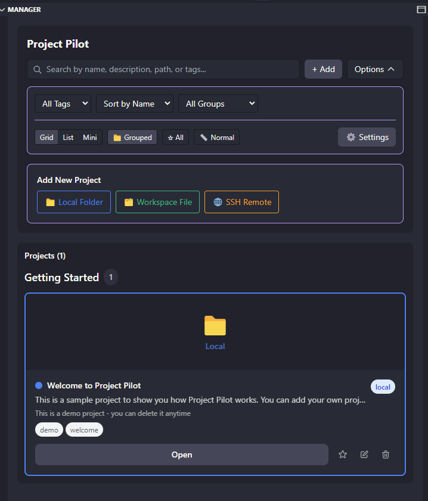
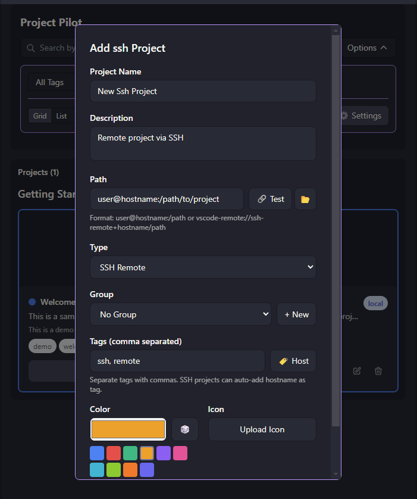
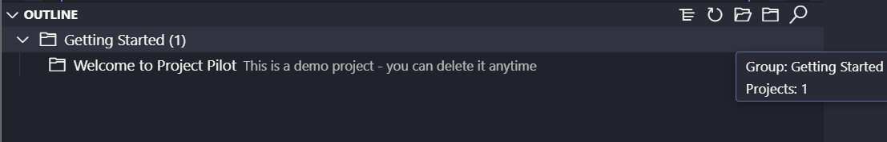

# Project Pilot

A modern, powerful project manager for Visual Studio Code that supports local folders, workspace files, and SSH remote projects with a beautiful React-based interface.

## 📦 Installation

[](https://marketplace.visualstudio.com/items?itemName=yczhang1028.project-pilot)
[](https://open-vsx.org/extension/yczhang1028/project-pilot)

**Install from VS Code Marketplace:**
- [Visual Studio Marketplace](https://marketplace.visualstudio.com/items?itemName=yczhang1028.project-pilot)

**Install from Open VSX Registry (for Cursor and other editors):**
- [Open VSX Registry](https://open-vsx.org/extension/yczhang1028/project-pilot)



*Project Pilot's main interface showing projects in grouped view with customizable colors and tags*

## ✨ Features

### 🎯 Core Functionality
- **Local Project Management**: Add and manage local folder projects
- **Workspace File Support**: Import and manage `.code-workspace` files
- **SSH Remote Projects**: Connect to and manage remote projects via SSH
- **Modern React UI**: Beautiful, responsive interface with grid and list views
- **Smart Search**: Search by name, description, path, or tags
- **Project Cards**: Customizable project cards with colors, icons, and tags

### 🛠️ Advanced Features
- **Auto-tag Detection**: Automatically detects project types and suggests relevant tags
- **Configuration Management**: Import/export configurations with validation and backup
- **Cross-platform Support**: Works seamlessly on Windows, macOS, and Linux
- **Backup System**: Automatic backups with configurable retention
- **SSH Connection Testing**: Test SSH connections before opening projects
- **Project Descriptions**: Add detailed descriptions with hover tooltips

### 🎨 User Experience
- **Dual View Modes**: Switch between grid and list views in Manager
- **Tree/List Toggle**: Outline view supports both flat and grouped display
- **Smart Filtering**: Filter by tags, project types, and search terms
- **Clickable Icons**: Direct project opening from list view icons
- **Keyboard Shortcuts**: Quick access to common actions
- **Hover Tooltips**: Rich information display on hover
- **Theme Integration**: Full VSCode theme support for seamless experience

## 🚀 Quick Start

### Installation
1. Install the extension from the VS Code marketplace
2. Open the Command Palette (`Ctrl+Shift+P` / `Cmd+Shift+P`)
3. Run `Project Pilot: Show Manager` to open the main interface
4. Or click the Project Pilot icon in the Activity Bar (left sidebar)

### First Steps
1. **Add your first project**: Click the `+ Add` button or use `Ctrl+P Ctrl+L`
2. **Customize your project**: Add descriptions, tags, and custom colors
3. **Organize with groups**: Create groups like "Work", "Personal", "Learning"
4. **Switch views**: Toggle between grid/list in Manager and tree/flat in Outline

### Adding Projects



*Easy project creation with multiple options and smart defaults*

#### Local Folders
- **Command**: `Project Pilot: Add Local Folder`
- **Shortcut**: `Ctrl+P Ctrl+L` / `Cmd+P Cmd+L`
- Select any folder on your system to add as a project

#### Current Folder
- **Command**: `Project Pilot: Add Current Folder`
- **Shortcut**: `Ctrl+P Ctrl+C` / `Cmd+P Cmd+C`
- Add the currently open workspace folder as a project

#### Workspace Files
- **Command**: `Project Pilot: Add Workspace File`
- Select any `.code-workspace` file to add as a project

#### SSH Remote Projects
- **Command**: `Project Pilot: Add SSH Remote`
- Enter SSH connection string in format: `user@hostname:/path`
- Supports vscode-remote URI format

### Managing Projects

#### Project Cards
Each project is displayed as a customizable card with:
- **Name**: Click to edit inline
- **Description**: Add detailed project descriptions
- **Path**: File system or SSH path
- **Type**: Local, Workspace, or SSH
- **Color**: Custom color coding
- **Icon**: Upload custom icons (converted to Base64)
- **Tags**: Organize with custom tags

#### View Modes
- **Grid View**: Card-based layout for visual browsing
- **List View**: Compact list with detailed information
- **Toggle**: Switch views using the toolbar buttons



*Outline view with tree structure showing grouped projects*

### Interface Views

Project Pilot provides multiple ways to view and organize your projects:

#### Manager View

- **Grid View**: Visual card-based layout with project previews
- **List View**: Compact list with detailed project information
- **Grouped Display**: Organize projects by custom groups
- **Search & Filter**: Find projects quickly by name, tags, or groups

#### Outline View  

- **Tree Structure**: Hierarchical display of grouped projects
- **Flat List**: Simple list view of all projects
- **Quick Access**: Click any project to open directly
- **Toggle Views**: Switch between tree and list modes

#### Search & Filter
- **Global Search**: Search across names, descriptions, paths, and tags
- **Tag Filter**: Filter by specific tags
- **Sort Options**: Sort by name, type, or recent additions

## ⚙️ Configuration

Access settings via `File > Preferences > Settings > Project Pilot`:

- **Default View**: Set default view mode (grid/list)
- **Auto Backup**: Enable automatic configuration backups
- **Max Backups**: Number of backup files to retain (1-20)
- **Show Type Icons**: Display type icons in tree view
- **Auto Detect Tags**: Automatically suggest tags for new projects

## 🔧 Commands

| Command | Description | Shortcut |
|---------|-------------|----------|
| `Project Pilot: Show Manager` | Open main interface | `Ctrl+P Ctrl+P` |
| `Project Pilot: Add Local Folder` | Add local project | `Ctrl+P Ctrl+L` |
| `Project Pilot: Add Current Folder` | Add current workspace | `Ctrl+P Ctrl+C` |
| `Project Pilot: Toggle Outline View` | Switch outline tree/list view | - |
| `Project Pilot: Add Workspace File` | Add workspace file | - |
| `Project Pilot: Add SSH Remote` | Add SSH project | - |
| `Project Pilot: Import Configuration` | Import config file | - |
| `Project Pilot: Export Configuration` | Export config file | - |
| `Project Pilot: Create Backup` | Manual backup creation | - |
| `Project Pilot: Restore Backup` | Restore from backup | - |
| `Project Pilot: Test SSH Connection` | Test SSH connections | - |
| `Project Pilot: Show Configuration Path` | Show config location | - |

## 📁 Configuration Files

### Location
Configuration files are stored in VS Code's global storage:
- **Windows**: `%APPDATA%/Code/User/globalStorage/project-pilot/data/projects.json`
- **macOS**: `~/Library/Application Support/Code/User/globalStorage/project-pilot/data/projects.json`
- **Linux**: `~/.config/Code/User/globalStorage/project-pilot/data/projects.json`

### Format
```json
{
  "projects": [
    {
      "id": "unique-id",
      "name": "Project Name",
      "description": "Project description",
      "path": "/path/to/project",
      "type": "local",
      "color": "#3b82f6",
      "tags": ["react", "frontend"],
      "icon": "data:image/png;base64,..."
    }
  ],
  "metadata": {
    "version": "1.0.0",
    "exportDate": "2024-01-01T00:00:00.000Z",
    "projectCount": 1
  }
}
```

## 🌐 SSH Remote Projects

### Supported Formats
- **Standard SSH**: `user@hostname:/path/to/project`
- **VS Code Remote URI**: `vscode-remote://ssh-remote+hostname/path`

### Requirements
- VS Code Remote-SSH extension installed
- SSH access configured on your system
- SSH keys or password authentication set up

### Testing Connections
Use `Project Pilot: Test SSH Connection` to validate SSH project configurations before opening.

## 🔄 Import/Export

### Exporting
1. Run `Project Pilot: Export Configuration`
2. Choose save location
3. Configuration saved with metadata and validation

### Importing
1. Run `Project Pilot: Import Configuration`
2. Select JSON configuration file
3. Automatic validation and backup creation
4. Projects merged with existing configuration

### Backup Management
- Automatic backups created before imports
- Configurable retention (1-20 files)
- Restore from any backup via command palette
- Backups include timestamp and metadata

## 🎨 Customization

### Project Colors
Choose from color picker or use hex values:
- **Local Projects**: Default blue (#3b82f6)
- **Workspace Files**: Default green (#10b981)
- **SSH Projects**: Default amber (#f59e0b)

### Icons
- Upload any image file (PNG, JPG, SVG)
- Automatically converted to Base64 for portability
- Displayed in both grid and list views

### Tags
- Add multiple tags per project
- Auto-detection based on project contents
- Filter and search by tags
- Visual tag display with counts

## 🛠️ Development

### Project Structure
```
project-pilot/
├── src/                    # Extension source code
│   ├── extension.ts       # Main extension entry point
│   ├── store.ts          # Configuration management
│   ├── managerViewProvider.ts  # Webview provider
│   └── outlineTreeProvider.ts  # Tree view provider
├── webview-ui/           # React frontend
│   ├── src/
│   │   └── ui/
│   │       └── App.tsx   # Main React component
│   └── package.json      # Frontend dependencies
├── package.json          # Extension manifest
└── README.md            # Documentation
```

### Building
```bash
npm run build          # Build both extension and webview
npm run build:ext      # Build extension only
npm run build:webview  # Build webview only
npm run watch          # Watch mode for development
```

### Quick Start for Development
1. Install dependencies and build:
```powershell
npm install
npm run build
```

2. Launch the extension in a new VS Code window via Run and Debug: "Run Extension"

3. For webview UI development:
```powershell
cd webview-ui
npm install
npm run dev
```

Then rebuild from the root to update the packaged assets:
```powershell
npm run build:webview
```

### Screenshots
- **Manager View**: `media/demo/demo_manager.png` - Main interface with grouped projects
- **Add Project**: `media/demo/demo_add.png` - Project creation modal with smart defaults  
- **Outline View**: `media/demo/demo_outline.png` - Tree view with project hierarchy
- **Overview**: `media/demo/demo.png` - General interface overview

## 🤝 Contributing

1. Fork the repository
2. Create a feature branch
3. Make your changes
4. Test thoroughly on all platforms
5. Submit a pull request

## 📄 License

MIT License - see LICENSE file for details

## 🐛 Issues & Support

Report issues on GitHub with:
- VS Code version
- Operating system
- Steps to reproduce
- Error messages (if any)

---

**Enjoy managing your projects with Project Pilot!** 🚀